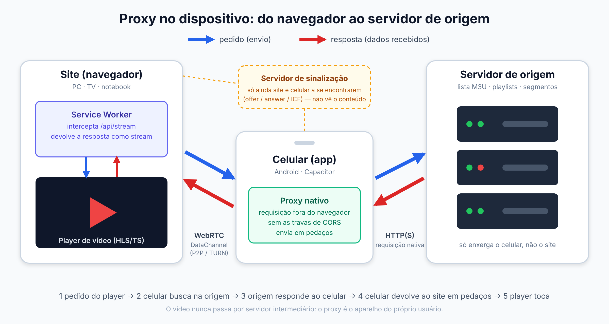

# cors-bypass-iptv

**Projeto de redes:** proxy no dispositivo com WebRTC, Service Worker e streaming.

Estudo sobre como um site no navegador consegue reproduzir mídia de servidores que ele não consegue acessar sozinho, usando o **celular do próprio usuário como intermediário (proxy)**. Aqui ficam só partes de interface e leitura de listas; a ponte em si não está neste repositório.

> Este projeto é um *player*. Não traz nenhum conteúdo nem lista. Use apenas com conteúdo que você tem direito de acessar.

## O problema

Um site roda dentro do navegador, que aplica regras de segurança ao próprio site:

- **CORS**: o navegador só deixa o site ler a resposta de outro servidor se esse servidor autorizar explicitamente.
- **HTTP misto**: uma página `https://` não pode carregar recursos `http://`.
- **Bloqueio por IP/origem**: alguns servidores só respondem ao aparelho do cliente, não a servidores na nuvem.

Essas regras valem **no navegador**. Um app nativo Android não está preso a elas, pois faz a requisição por fora do navegador.

## A ideia (em alto nível)



```
Site (navegador)  ⇄  conexão direta (WebRTC)  ⇄  App Android  →  Servidor de origem
```

1. O usuário abre o app no celular e o site no PC/TV e os dois se **conectam entre si**.
2. Quando o site precisa de um recurso, ele **pede ao celular** em vez de pedir ao servidor.
3. O celular faz a requisição (sem as travas do navegador) e **devolve em pedaços** pelo canal direto.
4. O site monta a resposta e o player toca normalmente.

Pontos que importam:

- **O proxy é o aparelho do usuário.** Os dados vão da origem ao celular e dele ao site; não passam por um servidor intermediário meu.
- Um servidor leve só ajuda os dois a **se encontrarem** (troca de informações de conexão). Ele não vê o conteúdo.
- Não é "invadir" nada: o celular acessa só o que o próprio usuário já tem permissão de acessar.

## O que aprendi/aplicado

- WebRTC (DataChannel, STUN/TURN, sinalização)
- Service Workers interceptando requisições e respondendo com streams
- Streaming de vídeo (HLS/TS) e cancelamento correto de requisições
- Controle de fluxo e *backpressure* ao enviar dados em pedaços
- Android nativo (WebView, serviço em primeiro plano) com Capacitor
- Cache local (IndexedDB) e desempenho de listas grandes no React

## Conteúdo do repositório

| Pasta | O que tem |
|---|---|
| `catalog/m3uParser.ts` | Lê listas M3U e agrupa séries/temporadas/episódios |
| `catalog/playlistCache.ts` | Guarda a lista completa no IndexedDB |
| `ui/useBackLayers.ts` | Botão "voltar" desfaz uma tela por vez |
| `ui/CategoryPage.tsx` | Grade paginada (5×6) |
| `ui/Top10Row.tsx` | Fileira Top 10 |
| `ui/MediaPlaceholder.tsx` | Imagens ilustradas para capa ausente |

## Licença

[MIT](LICENSE)   
